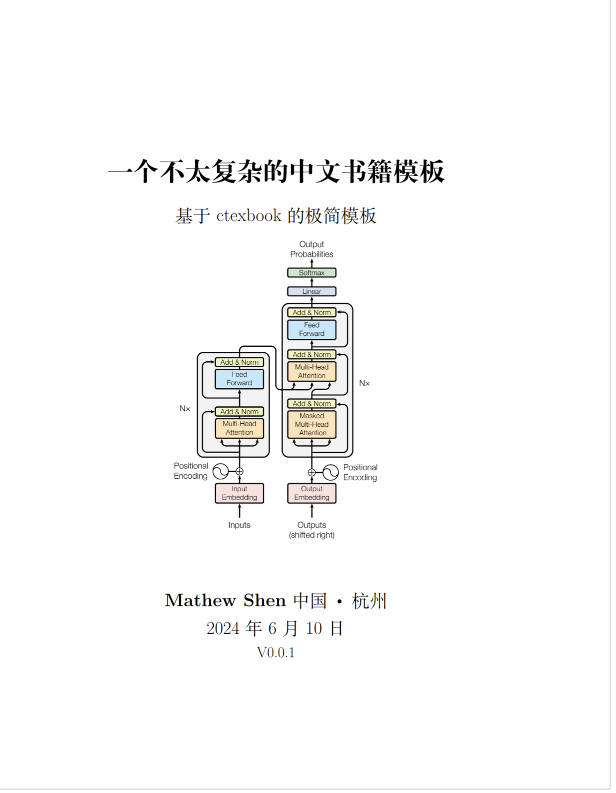
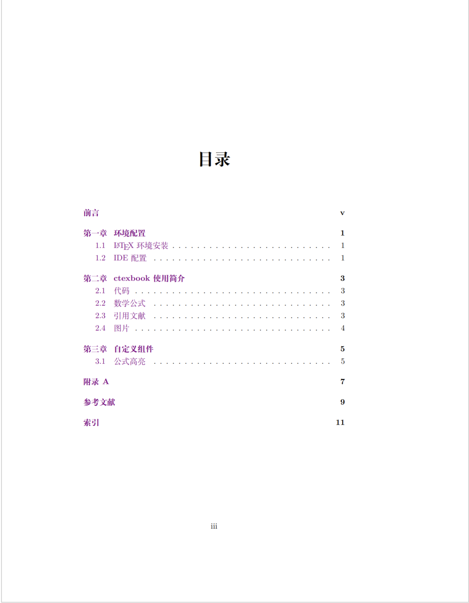
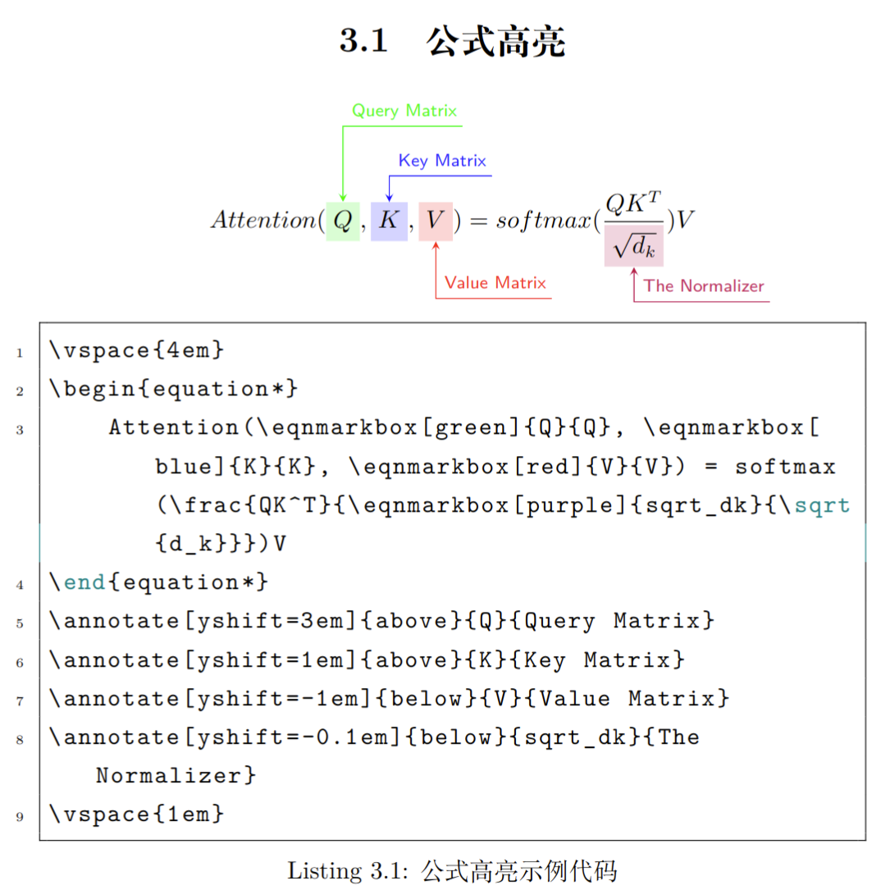

# 一个不太复杂的中文书籍 LaTeX 模板

基于 ctexbook 文档类，集成常用宏包的中文书籍模板。

## Features

- **文档类**: ctexbook (UTF-8 编码，小四号字)
- **页面布局**: geometry 精确控制页边距
- **参考文献**: biblatex + GB/T 7714-2015 国标格式 (biber 后端)
- **代码高亮**: listings (支持中文注释)
- **数学公式**: amsmath + amssymb + mathtools
- **公式注解**: annotate-equations (亮点功能)
- **算法伪代码**: algorithm2e (中文关键字)
- **彩色定理框**: tcolorbox (定义/定理/引理/推论/例/注)
- **提示框**: tipbox/warnbox/notebox
- **表格增强**: booktabs 三线表
- **交叉引用**: hyperref + cleveref
- **索引功能**: makeidx

## 快速开始

### 依赖

- TeX Live 或 MiKTeX (完整安装)
- latexmk
- [just](https://github.com/casey/just) (可选，用于命令简化)

### 编译

**使用 just (推荐):**

```bash
just build    # 编译 PDF
just watch    # 监听文件变化自动编译
just clean    # 清理临时文件
just open     # 打开 PDF 预览
just preview  # 编译并打开预览
```

**使用 latexmk:**

```bash
latexmk book.tex       # 编译
latexmk -pvc book.tex  # 监听模式
latexmk -c             # 清理临时文件
latexmk -C             # 彻底清理
```

**手动编译：**

```bash
xelatex book.tex
biber book
xelatex book.tex
xelatex book.tex
makeindex book.idx
xelatex book.tex
```

## 模板使用示例

### 定理框

```latex
\begin{definition}{欧拉公式}{euler}
  $e^{i\pi} + 1 = 0$
\end{definition}

\begin{theorem}{勾股定理}{pythagorean}
  直角三角形中，$a^2 + b^2 = c^2$。
\end{theorem}
```

### 算法伪代码

```latex
\begin{algorithm}[H]
  \caption{二分查找}
  \KwIn{有序数组 $A$，目标值 $x$}
  \KwOut{目标值的索引，或 $-1$}
  $l \leftarrow 0$, $r \leftarrow n-1$\;
  \While{$l \leq r$}{
    $m \leftarrow \lfloor (l+r)/2 \rfloor$\;
    \If{$A[m] = x$}{\KwRet{$m$}}
    \ElseIf{$A[m] < x$}{$l \leftarrow m+1$}
    \Else{$r \leftarrow m-1$}
  }
  \KwRet{$-1$}
\end{algorithm}
```

### 提示框

```latex
\begin{tipbox}
  这是一个提示信息。
\end{tipbox}

\begin{warnbox}
  这是一个警告信息。
\end{warnbox}

\begin{notebox}
  这是一个注意事项。
\end{notebox}
```

## Book PDF Preview

[book.pdf](./book.pdf)

## Screenshots

<p align="center">
    
</p>

<p align="center">
    
</p>

<p align="center">
    
</p>

## License

MIT License
